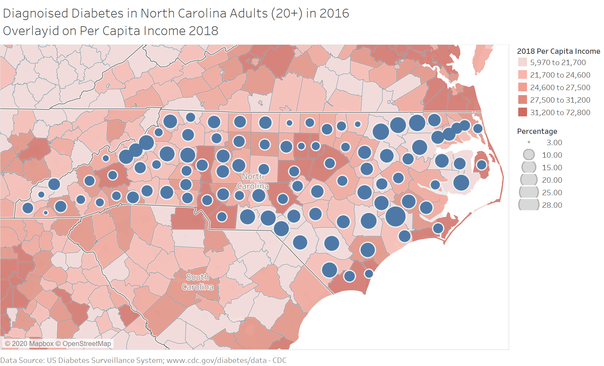
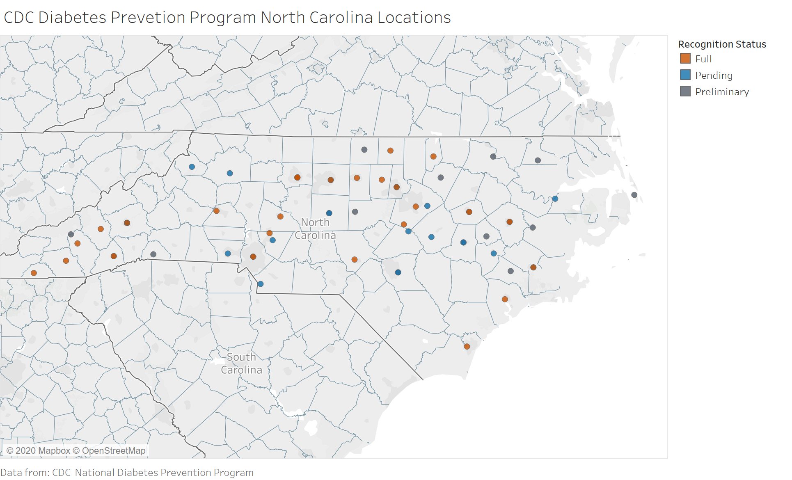

<!-- These two chunks should be added in the beginning of every .Rmd that you want to source an .R script -->
<!--  The 1st mandatory chunck  -->
<!--  Set the working directory to the repository's base directory -->
```{r, echo=F, message=F} 
#Don't combine this call with any other chunk 
# cat("Working directory: ", getwd()) # check where you are
  library(knitr)
# Rmd is in "./reports/reportA/reportA.Rmd", but now the root is "./"
  knitr::opts_knit$set(root.dir='../') 
```

<!--  The 2nd mandatory chunck  -->
<!-- Set the report-wide options, and point to the external code file. -->
```{r set_options, echo=F}
# set options shared by all chunks
opts_chunk$set(
  results='show', 
  message = TRUE,
  comment = NA, 
  tidy = FALSE,
  fig.height = 4, 
  fig.width = 5.5, 
  out.width = "550px",
  fig.path = 'figure_rmd/',     
  dev = "png",
  dpi = 400
  # fig.path = 'figure_pdf/',     
  # dev = "pdf"#,
  # dev.args=list(pdf = list(colormodel = 'cmyk'))
)
echoChunks <- FALSE
options(width=120) #So the output is 50% wider than the default.
# connect to the file with the underlying R script  
read_chunk("./analysis/rural-counties.R") 
```


<!-- Load packages to be used in this report. --> 
```{r load-packages, echo=echoChunks, message=FALSE, warning=FALSE}
```


<!-- Load the datasets.   -->
```{r load-data, echo=echoChunks, warning=FALSE, message=FALSE}
```

<!-- Inspect the datasets.   -->
```{r inspect-data, echo=echoChunks, results='show', message=FALSE}
```

<!-- Tweak the datasets.   -->
```{r tweak-data, echo=echoChunks, results='show', message=FALSE}
```

# Executive Summary

  In 2012 the estimated direct cost of diabetes care in North Carolina was \$8.4 billion dollars, with an additional \$2.5 billion dollars spent on indirect costs from lost productivity due to diabetes [@Association2016].  This total cost is expected to rise to $17 billion dollars is the epidemic remains unchecked [@Konen]. In 2015 the North Carolina Diabetes Advisory council released a guide in an attempted to rein in the epidemic. This guide was the North Carolina roadmap from 2015-2020, this report looks to check on the progress as well as provide additional ideas to solve the issue.
  
# Problem

<!-- Insert line graph -->
```{r line-graph, echo=echoChunks, results='show', message=FALSE}

```

Diabetes is a group of diseases marked by high levels of blood glucose resulting from defects in insulin production, insulin action, or both. Many forms of diabetes exist, the most common of which are type 1 diabetes, type 2 diabetes, and gestational diabetes [@Konen].  North Carolina as a whole averages well above the national average for diagnosed cases of Diabetes in Adults, averaging at around 11% of the total adult population versus the national average of around 8.5%. When broken down between census classified rural counties (of which 44 counties are considered 100% rural) against non-rural the problem is exaggerated even further. Since 2006 the amount of diagnosed adults in rural counties has grown from slightly of 10% to about 12% of the total adult population, this number is expected to continue to rise [@Association2016]. When viewed against the per captia income of each county it is again possible to see the discrepancy of diagnosed cases of diabetes.   In its 2015 report the North Carolina Diabetes Advisory Council (NCDAC) laid out suggestion for helping to stop the rise in diabetes cases in North Carolina, many of these being common throughout diabetes prevention.  They list 6 action items in the primary prevention of diabetes:
* Decrease the percentage of adults who are current smokers.
* Decrease the percentage of high school students reporting current use
of any tobacco product.
* Decrease the percentage of people exposed to secondhand smoke in
the workplace in the past seven days.
* Increase the percentage of high school students who are neither
overweight nor obese.
* Increase the percentage of adults getting the recommended amount of
physical activity.
* Increase the percentage of adults who consume five or more servings
of fruits and vegetables per day.

Many of these action items become more challenging for those North Carolinians that are living in rural areas as they may not have access to healthy food, and are much more likely to be smokers.  In fact in 2016, 28% of North Carolinians whose income was less then $25,000 dollars where smokers [@DiseaseControl2015].  The rural population is also less likely to have access to a CDC Diabetes Prevention Program, which is the biggest action item for NCDAC in the prevention of Diabetes.  Currently North Carolina has 77 registered CDC Prevention Programs, of these only 34 are designated has having achieved full CDC recognition [@DiseaseControl2018].  Overall it can be seen that North Carolina has a diabetes problem, and for those in the rural areas it can be even worse.

<!-- Insert Table -->
```{r  pct-diff, echo=echoChunks, results='show', message=FALSE}

```

# Policy Alternatives

  The current diabetes management plan in North Carolina is a good one, with one major flaw.  The idea is built on education, but how can people be educated without access to said education? There are two kinds of education provided for diabetes prevention, in person, and online. As stated before North Carolina has only 77 total registered prevention programs, almost all of which are centered in urban areas, limiting access to many of North Carolinas residents.   Some of these programs are able to be attended virtual, however again many rural North Carolinian's do not have access to broadband internet, causing this to not be a viable option. While these programs have been proven to work, and should continue, lack of access means there is still much more action to take [@Council2015].  
<!-- Insert Broadband Map -->
```{r code = readLines('broad-band-access.R'),echo=echoChunks, results='show', message=FALSE}

```

  
# Policy Recommendations

  This report is not meant to override current NCDAC polices but in fact build on top of them.  The programs provided by local agencies and governed by the CDC, must continue, however these programs need to be accessable by more rural North Carolinian's.  Currently if the programs were evenly distributed across North Carolina's population each program would have to handle roughly 17000 participants, this is an unsustainable amount of participants.  By provided more programs as well as better access to these programs, it is feasible that the rising trend of diabetes could reverse, or at least stay stable. 


# References